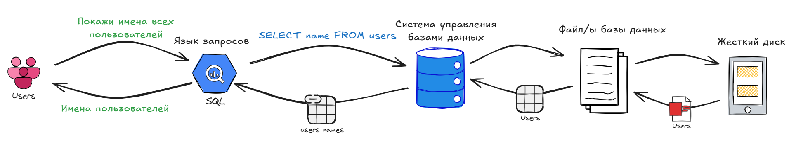
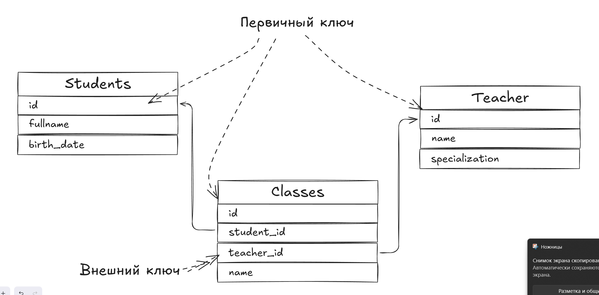
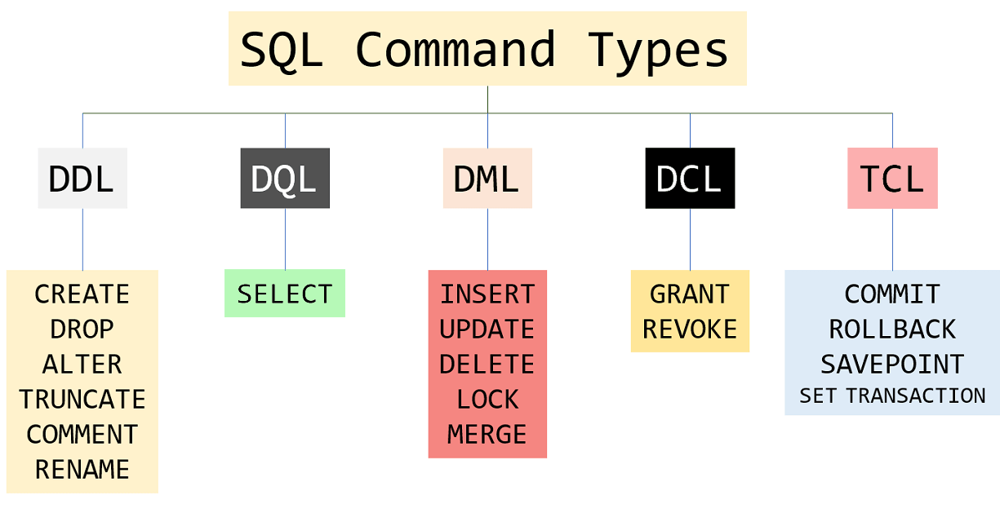

# Вводная для реляционных баз данных

Данный текст должен призван получить чуть более вводных для последующего погружения в мир работы с базами данных.

<!-- TOC -->
* [Вводная для реляционных баз данных](#вводная-для-реляционных-баз-данных)
  * [📌 Введение: зачем нужны базы данных?](#-введение-зачем-нужны-базы-данных)
  * [🗄 Какие бывают базы данных?](#-какие-бывают-базы-данных)
  * [💡 Зачем нужно такое разнообразие?](#-зачем-нужно-такое-разнообразие)
  * [🔗 Реляционные базы данных: таблицы и связи](#-реляционные-базы-данных-таблицы-и-связи)
      * [Первичный ключ](#первичный-ключ)
      * [Внешний ключ](#внешний-ключ)
  * [🎨 Типы данных реляционных баз данных](#-типы-данных-реляционных-баз-данных)
  * [📇 SQL: язык общения с базами данных](#-sql-язык-общения-с-базами-данных)
  * [📋 Sql операторы и клаузы (clauses)](#-sql-операторы-и-клаузы-clauses)
  * [🖇 Join и его виды](#-join-и-его-виды)
  * [🚀 Ускорение запросов](#-ускорение-запросов)
    * [1. Оптимизация структуры запросов](#1-оптимизация-структуры-запросов)
    * [2. Оптимизация JOIN-ов](#2-оптимизация-join-ов)
    * [3. Работа с индексами](#3-работа-с-индексами)
    * [4. Оптимизация подзапросов](#4-оптимизация-подзапросов)
    * [5. Оптимизация GROUP BY и ORDER BY](#5-оптимизация-group-by-и-order-by)
    * [6. Кэширование и денормализация](#6-кэширование-и-денормализация)
    * [7. Оптимизация для конкретных СУБД](#7-оптимизация-для-конкретных-субд)
  * [🎯 Что дальше?](#-что-дальше)
  * [Хорошие ресурсы для изучения sql](#хорошие-ресурсы-для-изучения-sql)
<!-- TOC -->

## 📌 Введение: зачем нужны базы данных?

Представим что вы являетесь владельцем частной школы для очень умных и смышленых ребятишек.
Вам нужно где-то хранить данные об учениках, их оценках, классах, учителях.
Также нужно хранить программы обучения, благодаря изучению которых ваши ребята смогут поступать в хорошие вузы.  
Для хранения информации мы можем выбрать комбинированный вариант - бумажный/цифровой.
Бумага нужна для сохранности и местами упрощения печатей (с цифровыми подписями сходу сложнее).
Данные на компухтере помогут просто искать и обновлять информацию.
Мы можем заводить файлы excel, в таблицах которых будем хранить информацию в нужном нам формате. Это по сути будут наши
**_базы данных_**.

`База данных` — это набор данных, хранящихся в структурированном виде.
Помимо excel документов мы можем также использовать и другие форматы, например csv, json, xml и т.д.

Однако хранение документов на компьютере в обычных файлах может быть не самым удобным, так как:

1) Нужно поддерживать определенную структуру каталогов (папок), чтобы можно было быстро искать информацию;
2) Обеспечить доступ для всех учителей такой, чтобы они могли менять данные, но не удалять структуру и архивные данные;
3) Обеспечить доступ для учеников, чтобы они могли спокойно читать данные и мониторить свои оценки.

Все это конечно можно настроить с помощью облачного хранилища, однако требует очень много усилий для поддержания
согласованности этих пунктов.
Человек существо ~~ленивое~~ умеющее делегировать свои задачи, автоматизировать рутинные действия.
И о чудо, мы же можем написать своего управленца файлами 🤩.  
Он бы и разбирался с этой кучей вопросов по поддержанию их в норме. Нам лишь останется ему командовать.

`Система управления базами данных (СУБД)` – это прежде всего обычное приложение,
которое осуществляет доступ к данным, позволяет их создавать, менять и удалять.  
В отличие от обычных файлов (например, .txt или
.csv), СУБД позволяют:

- Быстро искать данные (даже среди миллионов записей).
- Гарантировать целостность (например, не дать удалить ученика).
- Защищать данные (разграничивать доступ, чтобы ученики не могли менять свои оценки).

Пример работы с базой данных


## 🗄 Какие бывают базы данных?

* Реляционные – данные хранятся в таблицах, связанных между собой (как Excel на стероидах). Примеры: PostgreSQL, MySQL.
* Документные – данные хранятся как «документы» (например, JSON). Примеры: MongoDB.
* Ключ-значение – сверхбыстрое хранилище для кеша (Redis).
* Графовые – для сложных связей (соцсети, рекомендации). Пример: Neo4j.

Есть еще векторные, колоночные и многи другие...

> Главное понимать, что любая СУБД по сути есть приложение-управленец!
> Этот менеджер использует различные структуры данных для хранения информаций и множество всяких умных (и не очень)
> алгоритмов работы с данными структурами.

## 💡 Зачем нужно такое разнообразие?

У структур данных и алгоритмов есть характеристики.

Одни из ключевых метрик:

1) Скорость вставки (добавления)  
   Как быстро можно добавить новый элемент.

2) Скорость удаления  
   Как быстро можно удалить элемент.

3) Скорость поиска (доступа)  
   Как быстро можно найти элемент по индексу/ключу.

4) Скорость обновления (изменения)  
   Как быстро можно изменить значение элемента.

5) Потребление памяти (затраты по памяти)  
   Сколько дополнительной памяти требуется для хранения структуры.

6) Скорость перебора (итерации)  
   Как быстро можно пройти по всем элементам.

7) Поддержка упорядоченности  
   Сохраняет ли структура порядок элементов (например, сортировку).

8) Гибкость (динамичность)  
   Можно ли легко расширять/уменьшать размер структуры.

9) Эффективность в многопоточной среде  
   Насколько безопасно и быстро работает при параллельных операциях.

10) Сложность реализации  
    Насколько трудно написать и поддерживать такую структуру.

Не бывает таких структур данных, в которых все было бы очень хорошо. У всех есть плюсы и минусы.
Каждая база данных использует свой набор структур и алгоритмов работы, исходя из своего "предназначения".
> Как и в жизни, мы не можем выучить все предметы для успешной сдачи экзамена на поступление.
> Кто-то выбирает спорт, кто-то медицину, а кто-то работы с базами данных.

И тут имеет место очень примерное и поверхностное деление:

- Реляционные БД – для строгих структур (банки, интернет-магазины).
- NoSQL – для гибкости и скорости (чаты, аналитика).

[Подробнее про различные базы данных](https://habr.com/ru/companies/amvera/articles/754702/)

Здесь же я хочу остановиться на строковых реляционных базах данных.

## 🔗 Реляционные базы данных: таблицы и связи

Анатомия реляционной БД
Данные хранятся в таблицах (как листы Excel), где:

**Столбцы** – это поля (например, id, name, email).

**Строки** – это записи (конкретные данные, например, пользователь «Иван»).

Пример таблицы students:

| id | 	name  | 	email            |
|----|--------|-------------------|
| 1  | 	Иван  | ivan@example.com  |
| 2  | 	Мария | maria@example.com |

#### Первичный ключ

Любая система управления базами данных (СУБД) включает механизм обеспечения целостности и согласованности данных.
Этот механизм функционирует на основе правил, заданных в схеме базы данных.
Первичные и внешние ключи как раз относятся к таким правилам.  
Для исключения неоднозначности при поиске записей в таблицах используется первичный ключ, также известный как «ключевое
поле».  
**Ключевое поле (первичный ключ)** — это поле (или комбинация полей), уникальное значение которого идентифицирует каждую
запись в таблице.

Например, в таблице Student ключевым полем является id. Благодаря этому правилу СУБД не позволит добавить
запись с неуникальным значением в этом поле.
Стоит отметить, что первичный ключ не является обязательным элементом — целостность данных может поддерживаться,
например, на уровне приложения.

#### Внешний ключ

**Внешний ключ** — это поле (или набор полей) в одной таблице, которое ссылается на первичный ключ другой таблицы.  
Таблица, содержащая внешний ключ, называется дочерней, а таблица, на которую ссылаются, — родительской или ссылочной.  
Правило внешнего ключа гарантирует, что при добавлении записей в дочернюю таблицу значение внешнего ключа должно
существовать в родительской таблице.

Благодаря первичным и внешним ключам можно организовывать связи между таблицами.


Связи между таблицами могут быть:

* Один к одному (1:1) – например, паспорт и человек.
* Один ко многим (1:N) – у одного учителя много учеников.
* Многие ко многим (M:N) – студенты и курсы (через промежуточную таблицу).

Для того чтобы грамотно построить отношения между таблицами лучшие умы человечества выработали свод правил.
Они называются [Нормальные формы](https://habr.com/ru/articles/254773/).

## 🎨 Типы данных реляционных баз данных

В таблицах могут храниться различные типы данных - литералы.  
**Литерал** — это указанное явным образом фиксированное значение, например, число 12 или строка "SQL".

Литералы могут быть различных типов:

1. Числовые
    - INT / INTEGER: Целочисленные значения (например, 42).  
      Варианты: TINYINT, SMALLINT, BIGINT (разный диапазон).
    - DECIMAL(p, s) / NUMERIC(p, s): Точные числа с фиксированной запятой.
      p — общее количество цифр, s — знаки после запятой (например, DECIMAL(5,2) для 999.99).
    - FLOAT / REAL: Числа с плавающей запятой (приблизительные значения).

2. Символьные (строковые)
    - CHAR(n): Фиксированная длина строки (дополняется пробелами).
      Пример: CHAR(10) для "ABC ".
    - VARCHAR(n): Строка переменной длины (макс. n символов).
      Пример: VARCHAR(100) для текста до 100 символов.
    - TEXT: Длинный текст без ограничения длины (MySQL, PostgreSQL).

3. Типы даты и времени
    - DATE: Дата в формате ГГГГ-ММ-ДД (например, 2023-12-31).
    - TIME: Время (ЧЧ:ММ:СС).
    - DATETIME / TIMESTAMP: Дата и время (2023-12-31 23:59:59).
    - TIMESTAMP часто включает временную зону.

4. Логические
    - BOOLEAN: TRUE или FALSE (в PostgreSQL, MySQL использует TINYINT(1)).  
      Пример: is_active BOOLEAN.

5. Бинарные
    - BLOB (Binary Large Object): Хранение бинарных данных (изображения, файлы).
    - BINARY(n) / VARBINARY(n): Аналоги CHAR/VARCHAR для бинарных данных.

6. Специальные типы
    - ENUM: Список допустимых строковых значений (например, ENUM('Red', 'Green', 'Blue')).
    - JSON / XML: Хранение структурированных данных (поддерживается в современных СУБД).

> В разных реализациях(postgresql, oracle, mySql) они могут несколько упрощаться или наоборот дополняться.

## 📇 SQL: язык общения с базами данных

SQL (Structured Query Language) – это стандартный язык для работы с реляционными БД.

Данный язык нужен, для упрощения и стандартизации основных команд для нашей базы данных.
Он включает в себя различные типы запросов.



1. DDL (Data Definition Language) — Язык определения данных.  
   Назначение: Создание, изменение и удаление структуры БД (таблицы, индексы, схемы).  
   Команды:

    - CREATE — создать объект (таблицу, индекс, БД).
    - ALTER — изменить структуру объекта.
    - DROP — удалить объект.
    - TRUNCATE — очистить таблицу (удалить все данные, сбросить счётчики).
    - RENAME — переименовать объект.

2. DQL (Data Query Language) — Язык запросов данных.  
   Назначение: Только выборка данных (без изменения).  
   Команды:

    - SELECT — получить данные из таблиц.

3. DML (Data Manipulation Language) — Язык управления данными.  
   Назначение: Манипуляция данными внутри таблиц (добавление, изменение, удаление строк).
   Команды:

    - INSERT — добавить новые строки.
    - UPDATE — изменить существующие строки.
    - DELETE — удалить строки.
    - MERGE — объединить данные (вставка/обновление/удаление за одну операцию).

4. DCL (Data Control Language) — Язык управления доступом.  
   Назначение: Управление правами пользователей.  
   Команды:

    - GRANT — дать права на объекты БД.
    - REVOKE — отозвать права.

5. TCL (Transaction Control Language) — Язык управления транзакциями.  
   Назначение: Управление транзакциями (группами операций).  
   Команды:

    - COMMIT — подтвердить изменения (сохранить).
    - ROLLBACK — отменить изменения (вернуть состояние до начала транзакции).
    - SAVEPOINT — создать точку сохранения внутри транзакции.

> Важно!
> Транзакции (TCL) обеспечивают целостность данных: либо выполняются все операции в блоке (COMMIT), либо ни одна (
> ROLLBACK).

> DDL-команды необратимы в некоторых СУБД (например, DROP TABLE удаляет таблицу безвозвратно).

> TRUNCATE vs DELETE:  
> DELETE (DML) — удаляет строки построчно (можно откатить).  
> TRUNCATE (DDL) — мгновенно удаляет все данные (быстрее, но не откатывается в некоторых СУБД).

Эти категории помогают систематизировать работу с БД и обеспечивают безопасность данных.

## 📋 Sql операторы и клаузы (clauses)

Основные команды, это хорошо, но нельзя же работать с данными без каких либо уточнений.
Например, если мы хотим получить только пользователей с именем Иван, как нам быть?    
Для этого есть операторы и клаузы (clauses) — элементы, которые уточняют, как выполняется запрос.

🔹 Клаузы (Clauses)
Фрагменты SQL-запроса, которые выполняют конкретную роль:

- JOIN - используется для объединения данных из нескольких таблиц.
- WHERE – фильтрация строк до группировки (зачастую называется **условным оператором**).
- HAVING – фильтрация после группировки (только с GROUP BY).
- ORDER BY – сортировка результатов.
- GROUP BY – группировка строк.
- LIMIT / OFFSET – ограничение числа строк.

🔹 Операторы (Operators) - Логические или сравнительные элементы внутри клауз:

- AND, OR, NOT – логические операторы.
- IN, BETWEEN, LIKE – операторы сравнения.
- =, <, >, !=, IS – операторы условий.

> Здесь не будет подробного разбора работы операторов. Крайне рекомендую ознакомиться с ресурсами в конце статьи,
> где можно подробно почитать про работу операторов и попрактиковаться.

## 🖇 Join и его виды

| Тип JOIN	   | Описание                                                                                  |
|-------------|-------------------------------------------------------------------------------------------|
| INNER JOIN	 | Возвращает только строки, где есть совпадения в обеих таблицах.                           |
| LEFT JOIN	  | Возвращает все строки из левой таблицы + совпадения из правой (NULL если нет совпадений). |
| RIGHT JOIN  | 	Все строки из правой таблицы + совпадения из левой (NULL если нет совпадений).           |
| FULL JOIN   | 	Все строки из обеих таблиц (NULL в отсутствующих частях).                                |
| CROSS JOIN  | 	Декартово произведение (все возможные комбинации строк).                                 |

🔹 Синтаксис JOIN

```sql
SELECT
students.name,
classes.name
FROM
students
[INNER | LEFT | RIGHT | FULL] JOIN classes
ON students.id = classes.student_id [доп. условия через операторы];
```

## 🚀 Ускорение запросов

>Данный раздел не обязателен для первичного ознакомления!
>Если пока задача попрактиковаться, то лучше это сделать на специализированных ресурсах:  
>[Хорошие ресурсы для изучения sql](#хорошие-ресурсы-для-изучения-sql).

Оптимизация SQL-запросов помогает ускорить выполнение, снизить нагрузку на сервер и улучшить отзывчивость приложений.  
Вот ключевые методы:

### 1. Оптимизация структуры запросов

✅ **Выборка только нужных столбцов**

```sql
-- Плохо (выбирает всё)
SELECT * FROM students;

-- Хорошо (только нужные поля)
SELECT id, name, email FROM students;
```

✅ **Избегайте `SELECT DISTINCT` без необходимости.**  
`DISTINCT` требует сортировки и удаления дубликатов — это дорого.  
Лучше: Используйте `GROUP BY` или оптимизируйте запрос.  
✅ **Ограничивайте выборку с `LIMIT`**    
Однако тут нужно быть осторожным, в некоторых реализациях наоборот можно понизить производительность запроса

```sql
-- Выборка 10 записей вместо всех
SELECT * FROM students ORDER BY created_at DESC LIMIT 10;
```

✅ **Заменяйте `HAVING` на `WHERE` где возможно**  
HAVING фильтрует после группировки, WHERE — до (эффективнее).

```sql
-- Плохо
SELECT name, COUNT(*) FROM students GROUP BY birth_date HAVING birth_date > "01.01.2000";

-- Лучше
SELECT name, COUNT(*) FROM students WHERE birth_date > "01.01.2000" GROUP BY birth_date;
```

### 2. Оптимизация JOIN-ов

✅ **Фильтруйте данные ДО соединения**

```sql
-- Плохо (соединяет все, потом фильтрует)
SELECT * 
FROM students
JOIN classes ON students.id = classes.student_id
WHERE classes.name = '7Б'

-- Лучше (фильтрация до JOIN)
SELECT * 
FROM students
JOIN classes ON students.id = classes.student_id AND classes.name = '7Б'

-- Еще пример

-- Плохо (соединяет все, потом фильтрует)
SELECT * FROM orders o
LEFT JOIN users u ON o.user_id = u.id
WHERE u.country = 'USA';

-- Лучше (фильтрация до JOIN)
SELECT * FROM orders o
LEFT JOIN (SELECT * FROM users WHERE country = 'USA') u
ON o.user_id = u.id;

```

✅ **Используйте индексы для JOIN-полей**

```sql
-- Создайте индекс для поля, по которому соединяете таблицы
CREATE INDEX idx_user_id ON orders(user_id);
```

✅ **Избегайте сложных вычислений в ON**

```sql
-- Плохо (не может использовать индекс)
ON DATE(a.created_at) = DATE(b.published_at)

-- Лучше
ON a.created_at >= b.published_at 
AND a.created_at < b.published_at + INTERVAL 1 DAY
```

### 3. Работа с индексами

✅ **Добавляйте индексы на часто используемые поля**

```sql
-- Индекс для поиска по email
CREATE INDEX idx_email ON users(email);

-- Составной индекс для WHERE + ORDER BY
CREATE INDEX idx_status_created ON orders(status, created_at);
```

❌ **Избегайте лишних индексов**
Каждый индекс замедляет INSERT/UPDATE/DELETE.

**Индексы эффективны для высококардинальных полей** (много уникальных значений, например, email, id).

Всё зависит от кардинальности (количества уникальных значений) и распределения данных.
> Если 99% строк имеют значение TRUE, индекс почти не поможет — СУБД предпочтёт полный сканирование таблицы (Seq Scan).

✅ **Используйте EXPLAIN для анализа запросов**

```sql
EXPLAIN SELECT * FROM users WHERE email = 'test@example.com';
```

Что смотреть:

* type (лучше index или range, а не ALL).
* rows (сколько строк проверяется).
* key (используется ли индекс).

### 4. Оптимизация подзапросов

✅ **Заменяйте подзапросы на JOIN**

```sql
-- Плохо (подзапрос для каждой строки)
SELECT * FROM products 
WHERE category_id IN (SELECT id FROM categories WHERE active = 1);

-- Лучше (JOIN эффективнее)
SELECT p.* FROM products p 
JOIN categories c ON c.active = 1 AND  p.category_id = c.id;
```

✅ **Используйте EXISTS вместо IN для больших таблиц**

```sql
-- Быстрее, если подзапрос возвращает много данных
SELECT * FROM orders o 
WHERE EXISTS (SELECT 1 FROM users u WHERE u.id = o.user_id AND u.active = 1);
```

### 5. Оптимизация GROUP BY и ORDER BY

✅ Сортируйте по индексированным полям

```sql
-- Индекс ускорит сортировку
CREATE INDEX idx_created_at ON orders(created_at);
SELECT * FROM orders ORDER BY created_at DESC;
```

✅ Избегайте сортировки, если можно

```sql
-- Если порядок не важен, укажите это
SELECT * FROM users ORDER BY NULL;
```

### 6. Кэширование и денормализация

✅ **Используйте кэш запросов**

- MySQL: query_cache_size.
- PostgreSQL: pg_prewarm.

✅ **Денормализация для частых запросов**  
Иногда лучше добавить избыточные данные, чем делать сложные JOIN:

```sql
ALTER TABLE orders ADD COLUMN customer_name VARCHAR(100);
UPDATE orders o SET customer_name = u.name FROM users u WHERE o.user_id = u.id;
```

### 7. Оптимизация для конкретных СУБД

**MySQL**

- Включите slow_query_log для поиска медленных запросов.
- Используйте FORCE INDEX при необходимости.

**PostgreSQL**

- Применяйте PARTITIONING для больших таблиц.
- Используйте pg_stat_statements для анализа нагрузки.

**SQL Server**

- Добавьте WITH (NOLOCK) для чтения без блокировок (если допустимо).
- Используйте OPTION (RECOMPILE) для сложных запросов.

> Главное правило:
> «Измеряйте перед оптимизацией!» — используйте EXPLAIN и профилирование, чтобы найти реальные проблемы.

## 🎯 Что дальше?

Можно углубляться в:

- Встроенные функции (агрегатные функции, процедуры).
- Индексы (как ускорить поиск).
- Транзакции (как избежать потери данных при сбоях).
- Оптимизация запросов (как правильно писать запросы и как находить узкие места производительности).
- Оконные функции (вычисления над набором строк).
- Hibernate, JOOQ – В рамках java данные инструменты позволяют упростить взаимодействие с БД.

## Хорошие ресурсы для изучения sql

1. [Классная обучалка базе sql с проработанной и не душной теорией и хорошей практикой](https://sql-academy.org/ru)
2. [Ужасный интерфейс, но куча шикарных задач](https://sql-ex.ru/)
3. [Интерактивный тренажер sql](https://stepik.org/course/63054/syllabus)
4. [Парень мне этот не нравится, но видос вполне годный](https://youtu.be/5sG9kmXYsKU?si=abji9RzxYC_H5XSP)
