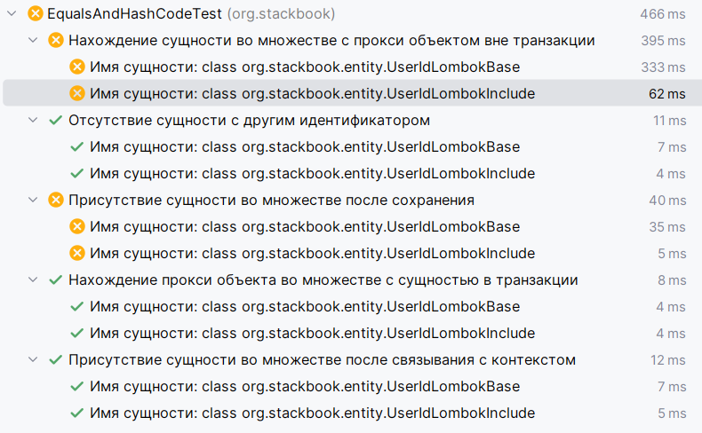
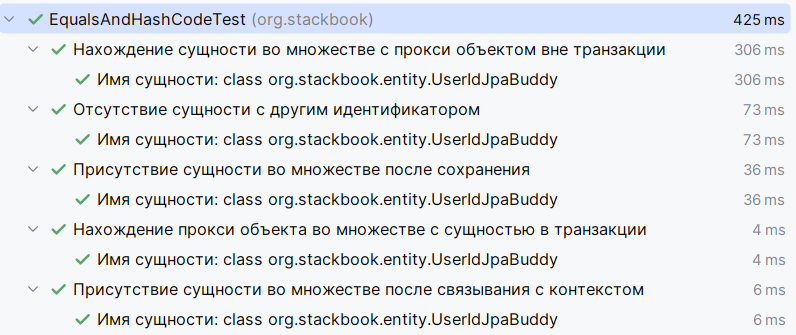
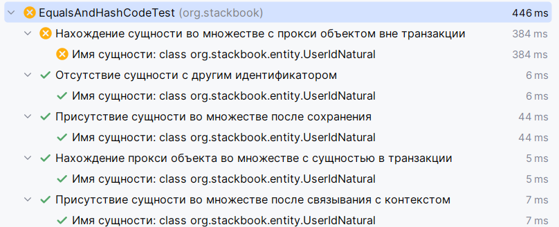
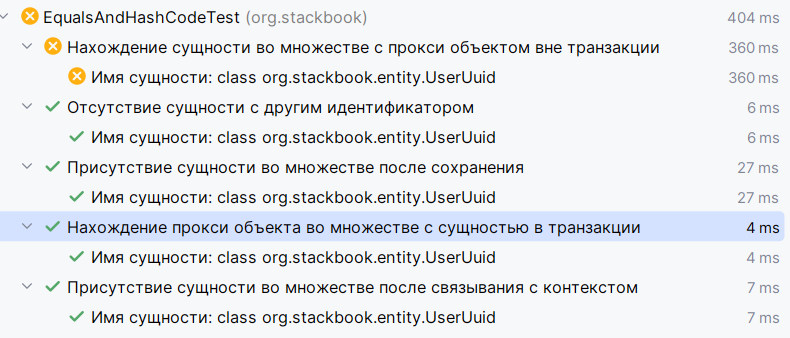
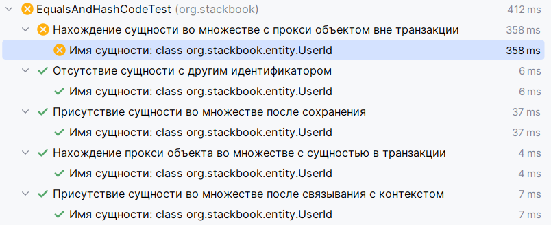
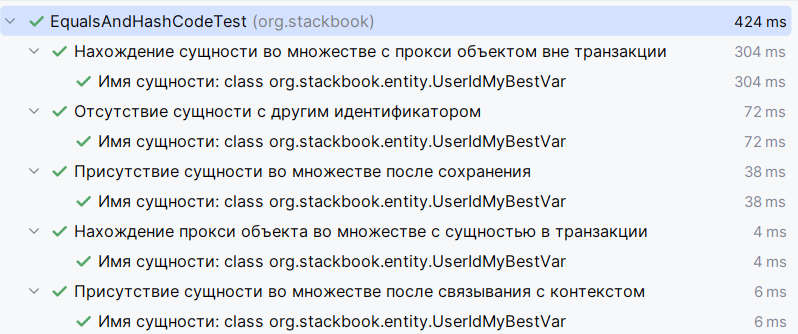

# Рабочая реализация методов сравнения и хеширования для моделей и сущностей
Оглавление
<!-- TOC -->
* [Рабочая реализация методов сравнения и хеширования для моделей и сущностей](#рабочая-реализация-методов-сравнения-и-хеширования-для-моделей-и-сущностей)
  * [Вводная](#вводная)
  * [Технологии](#технологии)
    * [Стек](#стек)
  * [Установка и запуск](#установка-и-запуск)
  * [Теория сравнения](#теория-сравнения)
    * [Виды сравнений](#виды-сравнений)
  * [Практика сравнения сущностей](#практика-сравнения-сущностей)
    * [Стандартный вариант без переопределения](#стандартный-вариант-без-переопределения)
      * [Вводная](#вводная-1)
      * [Результаты тестов](#результаты-тестов)
      * [Вывод](#вывод)
    * [Lombok не держит удар](#lombok-не-держит-удар)
      * [Вводная](#вводная-2)
      * [Результаты тестов](#результаты-тестов-1)
      * [Вывод](#вывод-1)
    * [Плагины — наше всё](#плагины--наше-всё)
      * [Вводная](#вводная-3)
      * [Результаты тестов](#результаты-тестов-2)
      * [Вывод](#вывод-2)
    * [Он настоящий](#он-настоящий)
      * [Вводная](#вводная-4)
      * [Результаты тестов](#результаты-тестов-3)
      * [Вывод](#вывод-3)
    * [Ты не настоящий астро рейнджер! Ты игрушка!](#ты-не-настоящий-астро-рейнджер-ты-игрушка)
      * [Вводная](#вводная-5)
      * [Результаты тестов](#результаты-тестов-4)
      * [Вывод](#вывод-4)
    * [Легенда при жизни](#легенда-при-жизни)
      * [Вводная](#вводная-6)
      * [Результаты тестов](#результаты-тестов-5)
      * [Вывод](#вывод-5)
    * [Бюро находок](#бюро-находок)
      * [Вводная](#вводная-7)
      * [Результаты тестов](#результаты-тестов-6)
      * [Вывод](#вывод-6)
  * [Общий вывод](#общий-вывод)
  * [Источники](#источники)
<!-- TOC -->

## Вводная

Рано или поздно при работе с объектами и хэш-коллекциями мы сталкиваемся с вопросами: «Где моя сущность?» или «Почему они не равны?».
В контексте работы с важными данными эти вопросы становится еще более актуальными.  
А самое что страшное, что нет единого ответа на вопрос: «А как сделать мне в моём проекте?» 🥺

Если попытаться отправить такой запрос в нейросеть, нет гарантии, что в ответе будет рабочий код.
Браузер же выдаст кучу статей, после прочтения которых создаётся ощущение: «Ага, сравниваем как хотим, лишь бы заработало».

В данном репозитории я все же пытаюсь дать ответ как правильно сравнивать объекты в ООП-ориентированных языках

## Технологии

Примеры реализаций методов написаны на языке Java, однако концепции описанные здесь можно применять на любом языке.

### Стек

- Java 24
- Spring Boot 3
- Spring Boot Data Jpa с Hibernate (в качестве ORM)
- Spring Boot Test (для тестов)
- H2 (для тестов)
- Lombok (для удобства и для добавления падающих тестов с его реализацией методов 😈)
- Postgresql (чтобы был)
- datasource-proxy-spring-boot-starter (для подробного логирования)

Остальные зависимости можно посмотреть в [pom.xml](pom.xml) в dependency.

## Установка и запуск

Тут все стандатно:

- качаем с гита (либо git clone [url], либо zip архив и распаковка)
- проверяем, что установлена 24 Java и проставлен JAVA_HOME в переменных окружения
- проверяем, что есть Maven и проставлена к исполняемому файлу переменная окуржения
- далее для запуска тестов: *mvn clean test*

## Теория сравнения

Во многих ООП-ориентированных язык реализованы методы сравнения объектов, такие как:
- `__eq__`, `__hash__` в python;
- `equals`, `hashCode` в java, kotlin;
- `Equals` и `GetHashCode` в c#;
- и т.д.

И тут я хочу описать те вопросы, что были у меня, когда я услышал про методы equals и hashCode в java:

- Ага, equals сравнивает объекты, но есть же ==, зачем два метода сравнения?
- Что вообще такое `hashCode` и как он связан с equals?
- Почему нельзя раз написать и забыть про их существования обычному разработчику?

Крайне рекомендую попытаться узнать ответы на эти вопросы у нейронки, если еще не узнали.
Мои же блиц ответы:

- `equals` в стандартной реализации Java (`Object`) работает аналогично `==` (сравнение объектов по ссылке в памяти), однако его
  рекомендуется переопределять для более очевидного поведения с точки зрения бизнеса;
- `hashCode` это оптимизационный костыль, чтобы в хэш-структурах твой экземпляр класса не терялся и быстро находился;
- Можно, но не для всего. И тут нужно остановиться и рассказать подробнее.

### Виды сравнений

Задам простой вопрос, как можно сравнить двух собак?
Поразмыслив, можно назвать два основных способа:

1) По признакам, например по размеру, весу, шерстке, возрасту;
2) По ветеринарному паспорту.

В первом случае мы смотрим на все признаки собак и сравниваем их.
Во втором случае предполагаем, что собаки могут находиться в разных временных промежутках и иметь разные показатели.

И так плавно мы переходим к двум основным типам объектов: изменяемые и нет.

В качестве неизменяемых объектов зачастую выступают модели данных, которые определяют согласованные и консистентные
состояния.
Способ сравнения для них во многом прост, сравнить все поля друг друга (иногда нужно сравнение для полей всех вложенных
объектов).
Для моделей создатели языков программирования во многом позаботились, разработав такие структуры как:

- record в java, c#;
- датаклассы в kotlin, python;
- любые структуры в golang;
- др.  

При создании объекта получаются готовые методы сравнения. 
[Подробнее про концепцию деления объектов на разные виды](https://dev.to/jannikwempe/domain-driven-design-entities-value-objects-and-how-to-distinguish-them-4lla).

Однако с объектами, которые могут меняться во времени не так все просто.
У той же собаки может не быть паспорта, и как быть?
В самых стандартных вариантах в языках программирования реализовано сравнение объектов по прописке (адрес в памяти).
Когда объект создается, он где-то должен храниться. Там, где он хранится - адрес, есть его уникальная неизменяемая
черта.
Казалось бы, вопрос решен, разработчик языка позаботился о работягах, реализовал за нас сложный механизм сравнения ячеек памяти,
гуляем.
Вычислили координаты наших пёсиков и готово.


И нет! В случае разработки код живет вне времени, наша одна и та же собака может существовать в разных уголках памяти и
иметь двойников 🤯.
Мультивселенная ли, но в коде эти собаки должны быть равны!
Когда мы создадим одну собаку в одном месте, я хочу, чтобы ее копия, пусть и с потрепанной шерсткой, рожденная в параллельном мире была ей равна! Даешь
равенство! 😁

Наша собака эта сущность, которая может изменяться до неузнаваемости, создаваться в разных местах.
Чтобы ее не потерять мы можем надеть на неё хотя бы ошейник.
В случае человека, у нас есть ДНК. Либо если это два камня мы можем покрасить их.

**Подытожив:**

1) Неизменяемые объекты (модели/дто/объекты-значения) - просто сравниваем все признаки;
2) Изменяемые (сущности) - находим неизменяемую точку опоры (уникальный идентификатор).

## Практика сравнения сущностей

Тут нюанс, дальше всё повествование будет вестись в контексте java JPA Hibernate, поскольку и без того мыслей много 🥸. 
Однако данные практики применимы для любых сущностей как ORM, так и обычных сущностей созданных из возвращаемого 
кортежа/json/любого объекта из бд.  
Для наших экспериментов я написал [ряд тестов](src/test/java/org/stackbook/EqualsAndHashCodeTest.java).
Основная логика проверок была позаимствована у [Vlad Mihalcea](https://vladmihalcea.com/how-to-implement-equals-and-hashcode-using-the-jpa-entity-identifier/)

### Стандартный вариант без переопределения

#### Вводная
Напомню, стандартная реализация опирается на ссылку объекта в памяти.

Пример в [UserIdDefault.java](src/main/java/org/stackbook/entity/UserIdDefault.java)  
#### Результаты тестов


#### Вывод

Не проходят тесты связанные с изменением состояния сущности контексте ORM и сравнение оригинала с копией.
В случаях обычных CRUD-методов все будет хорошо.
Однако при более сложных сценариях (Работа с хэш-таблицами, кэш второго уровня, работа вне транзакции) не годится.

### Lombok не держит удар
#### Вводная
Здесь разбираем сразу два варианта:  
1) @EqualsAndHashCode;  
2) @EqualsAndHashCode(onlyExplicitlyIncluded = true) c @EqualsAndHashCode.Include на @Id поле

Примеры в [UserIdLombokBase.java](src/main/java/org/stackbook/entity/UserIdLombokBase.java)
[UserIdLombokInclude.java](src/main/java/org/stackbook/entity/UserIdLombokInclude.java)  

#### Результаты тестов



#### Вывод
Оба провалились при работе с прокси объектами:
 - первый не нашел проксю во множестве;
 - второй пал, сделав доп запрос в базу.

Также оба не справились в нахождении сущности после сохранения. Это может показаться странным,
однако посмотрев код метода hashCode() в папке target [UserIdLombokInclude.class](target/classes/org/stackbook/entity/UserIdLombokInclude.class),
увидим:
```java
    @Generated
    public int hashCode() {
        int PRIME = 59;
        int result = 1;
        Object $id = this.getId();
        result = result * 59 + ($id == null ? 43 : $id.hashCode());
        return result;
    }
```
Как нам известно (или станет известно) при сохранении объекта в hash-структуру у нас рассчитывается его бакет 
хранения на основе метода hashCode. 
Когда мы добавляли элемент в Set у нас поле id было null. После сохранения, ORM проставил id сгенерированный в базе, 
тем самым переопределив hashCode.
В результате произошло - мы добавили объект с одним кодом, после сохранения теперь код другой.
Это чем-то похоже на кэширование. В хэш структурах применяется для ускорения поиска.

> Не маловажным для сущностей является соответствие правилу null не равно null для id, которое нарушается при генерации в 
> @EqualsAndHashCode(onlyExplicitlyIncluded = true) c @EqualsAndHashCode.Include

### Плагины — наше всё
#### Вводная
При интеграции в работу плагинов по типу JpaBuddy или Amplicode ими будет предлагаться следующий вариант:
[UserIdJpaBuddy.java](src/main/java/org/stackbook/entity/UserIdJpaBuddy.java)

#### Результаты тестов


#### Вывод
Вот он чемпион! Лучшая реализация! Кубок в студию!  
Но посмотрев на реализацию в кучу строк, присутствие непонятно каких классов, лично мне хочется закрыть ноутбук и убежать 🫣  
Знатоки, конечно, скажут, ну, во-первых, это база, это знать надо. 
Во-вторых, тебе писать не нужно, попроси своего СТО, пускай он купит лицензию и будешь генерировать эти методы в два клика.  
Но я скажу вам что:  
Во-первых, ОРМ придумана для упрощения написания кода, а не для хитро-сделанных методов.  
Во-вторых, работая в компании, которая за импортозамещение, далеко не факт, что будет сама возможность покупки лицензии.  
В-третьих, идет реальная привязка к реализации и при смене той же ОРМ нам нужно прокликнуть по всем классам и вызвать перегенерацию.

По итогу, если первые два моих довода не столь страшны с точки зрения самого разработчика, то третий сам Робертом Мартином выведен.
Уменьшить инъекцию инфраструктурного кода возможно и почему бы этим не пользоваться.

### Он настоящий

#### Вводная
В ряде случаев можно чуть расслабиться и довериться делу. Помимо генов у человека, есть еще множество уникальных
вещей в бизнесе, да и в жизни в целом. Если у нашей сущности есть такой показатель, почему бы им не воспользоваться.

Пример: [UserIdNatural.java](src/main/java/org/stackbook/entity/UserIdNatural.java)

#### Результаты тестов

#### Вывод
Почти все тесты прошли успешно. Пала прокся из-за доп. запроса - цена согласованности.
Если у вас есть бизнес-ключ, то возможно использование прокси для оптимизации вам и не нужно.

### Ты не настоящий астро рейнджер! Ты игрушка!

#### Вводная
С помощью строковых идентификаторов мы можем смоделировать бизнес-ключ.
Пример: [UserUuid.java](src/main/java/org/stackbook/entity/UserUuid.java)

#### Результаты тестов

#### Вывод
Такая же история, как и с натуральным идентификатором.
Плюсы и минусы данного подхода хорошо описаны [здесь](https://jpa-buddy.com/blog/the-ultimate-guide-on-client/).  
Если кратко, то мы получаем почти натуральный id, но получаем трудности в тестировании, проблемы с производительностью.
Использовать можно, но осторожно.

### Легенда при жизни

#### Вводная
Реализация от джава чемпиона Vlad Mihalcea, описанная [в его статье.](https://vladmihalcea.com/how-to-implement-equals-and-hashcode-using-the-jpa-entity-identifier/)

Пример: [UserId.java](src/main/java/org/stackbook/entity/UserId.java)
#### Результаты тестов

#### Вывод
Данная реализация очень хороша, она одна из моих любых. Проста, лаконична и не проходит лишь тест с проксей.
В целом могло бы и не быть данного анализа, я бы спокойно пользовался этой версией, однако у нее есть существенный недостаток.
Это использование метода `getClass` для хэш кода и `instanceOf` для `equals`. 
В моем понимании это нарушение контракта между двумя этими методами.

С другой стороны, если не душиться всякими контрактами и оптимизациями (которые могут и не пригодиться) -
**это на мой взгляд самый простой, понятный и рабочий вариант.**

### Бюро находок
#### Вводная
В моих влажных мечтах было найти оптимальный вариант, стандартный, который можно было вставить и не париться.
Взяв за основу версию легенды, я решил соблюсти контракт.

Пример: [UserIdMyBestVar.java](src/main/java/org/stackbook/entity/UserIdMyBestVar.java)
#### Результаты тестов

#### Вывод
Все тесты прошли.
Было решено сделать методы `final`, так же, как и в версии плагинов, чтобы прокси объект отрабатывал корректно.
Для метода hashCode теперь берется hash основного класса, что при наследовании будет эквивалентно instanceOf для equals.
Контракт соблюден.

> Не могу не отметить нюанс касаемо использования в методах equals и hashCode конструкций instanceOf и getClass. 
> На вкус и цвет товарищей нет, мне, например ближе подход по SOLID с instanceOf.

## Общий вывод
Мой вариант оказался надёжным простым, поэтому его смело можно взять за основу! 🥹
Но если быть серьезным, каждый из вариантов имеет свои плюсы и минусы, которые я старался подчеркнуть.
Итого:
- можно не переопределять методы, если мы точно уверены, что у нас нет всяких hash-структур в коде и не будет сложных 
сравнений с копиями объектов;
- lombok для сущностей вреден. Желательно не переопределять методы equals и hashCode с помощью него;
- плагины создают идеальную реализацию на основе getClass, но она противоречит SOLID в отношении наследования и сильно привязана к фреймворку ORM;
- натуральный id хорош, но он не всегда есть;
- Vlad Mihalcea описал практически идеальную реализацию, которой чуть-чуть не хватило до оптимального варианта. Ее можно смело использовать;
- Мой вариант это лишь попытка улучшить версию Vlad Mihalcea, лишить ее каких-либо противоречий.

## Источники

Чтобы самому додуматься, как сравнивать объекты, не хватило бы и Аристотеля рядом.
Но он и не нужен, когда есть поисковая строка, которая при вводе нужного запроса выдает:

1) [Про DDD](https://dev.to/jannikwempe/domain-driven-design-entities-value-objects-and-how-to-distinguish-them-4lla)
2) [Контракт equals и hashCode](https://javarush.com/groups/posts/1989-kontraktih-equals-i-hashcode-ili-kak-ono-vsje-tam)
3) [Эталонный вариант реализации с детальным разбором, но придется привязаться к ORM](https://jpa-buddy.com/blog/hopefully-the-final-article-about-equals-and-hashcode-for-jpa-entities-with-db-generated-ids/)
3) [Про доверие либам в столь важных вопросах (В данном случае Lombok)](https://habr.com/ru/companies/haulmont/articles/836018/)
4) [И еще Lombok](https://habr.com/ru/companies/haulmont/articles/564682/)
5) [Baeldung и его реализация, не выдерживающая реальности](https://www.baeldung.com/jpa-entity-equality)
6) [Очень интересная реализация, которая выглядит довольно сложно](https://jivimberg.io/blog/2018/11/05/using-uuid-on-spring-data-jpa-entities/)
7) [Разбор варианта с генерацией UUID на стороне приложения](https://jpa-buddy.com/blog/the-ultimate-guide-on-client/)
8) [Гений Hibernate'а и его взгляд на проблему](https://vladmihalcea.com/how-to-implement-equals-and-hashcode-using-the-jpa-entity-identifier/)
